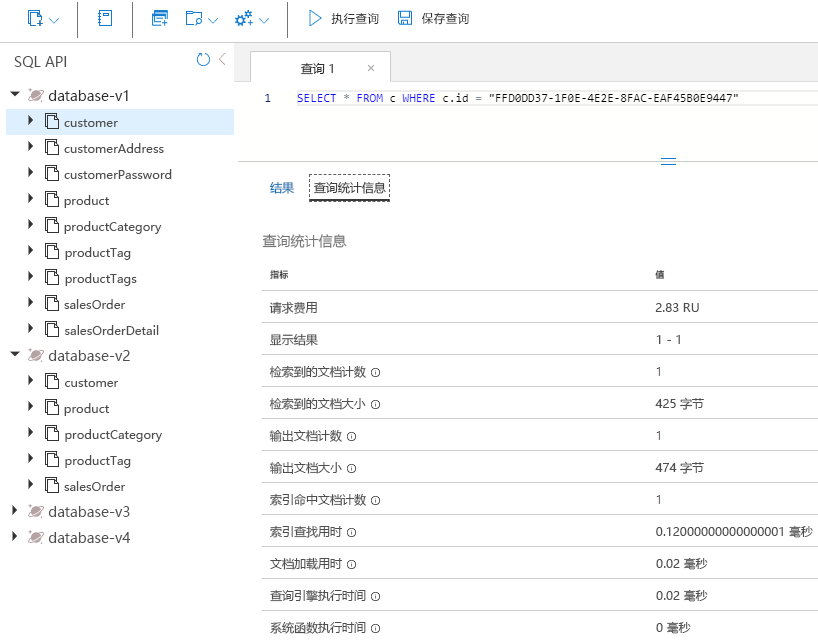
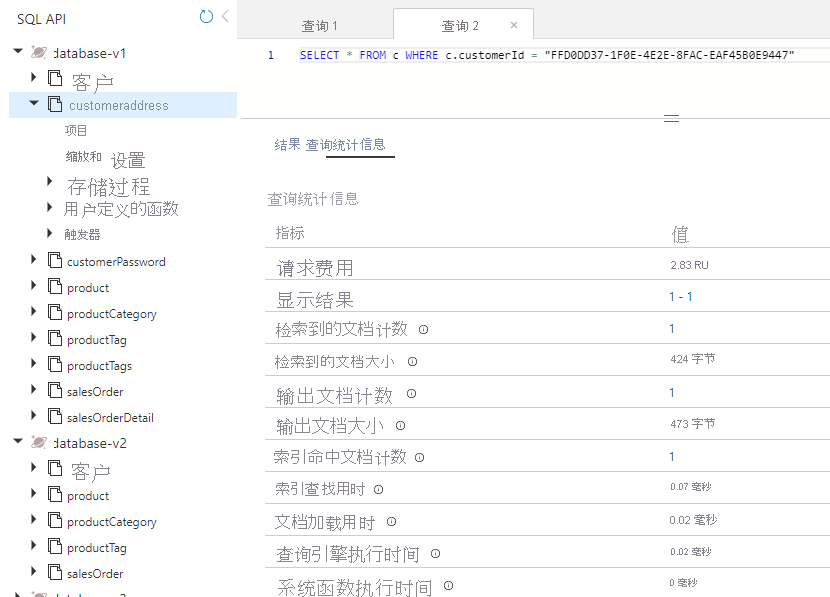
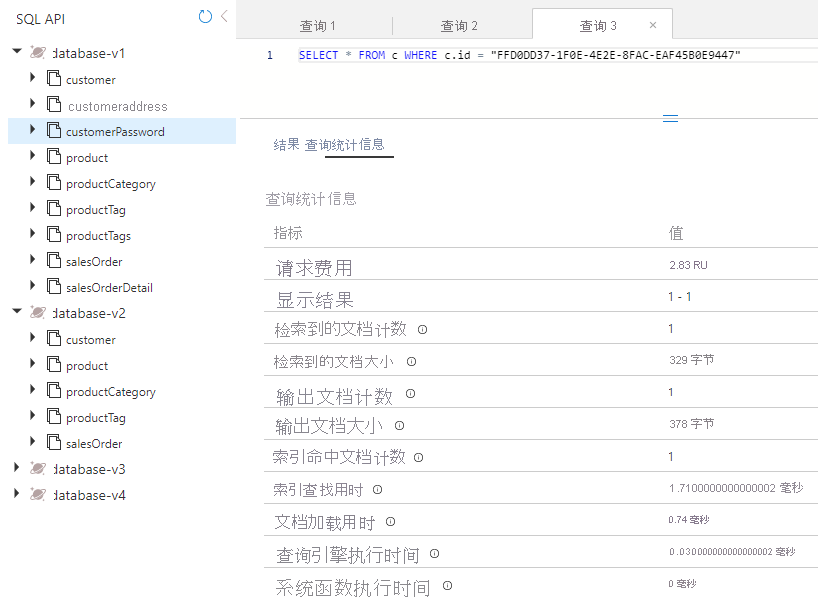
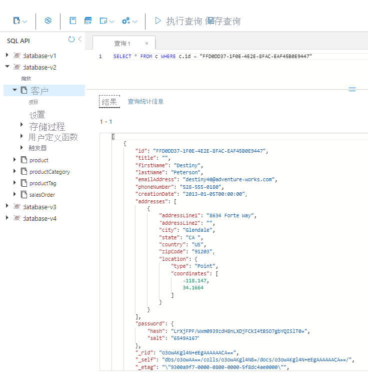

---
lab:
  title: 衡量不同嵌入容器中的实体的性能
  module: Module 8 - Implement a data modeling and partitioning strategy for Azure Cosmos DB SQL API
ms.openlocfilehash: b3f7be3d3f7674fc19b2823de50d013e3bd4b04d
ms.sourcegitcommit: b90234424e5cfa18d9873dac71fcd636c8ff1bef
ms.translationtype: HT
ms.contentlocale: zh-CN
ms.lasthandoff: 01/12/2022
ms.locfileid: "138024903"
---
# <a name="measure-performance-of-entities-in-separate-and-embeded-containers"></a>衡量不同嵌入容器中的实体的性能

在本练习中，你将衡量将实体建模为单独的容器时与为将实体嵌入单个文档的 NoSQL 数据库建模时的客户实体的差异。

## <a name="prepare-your-development-environment"></a>准备开发环境

如果你还没有将 DP-420 的实验室代码存储库克隆到使用此实验室的环境，请按照以下步骤操作。 否则，请在 Visual Studio Code 中打开以前克隆的文件夹。

1. 启动 Visual Studio Code。

    > &#128221; 如果你还不熟悉 Visual Studio Code 界面，请参阅 [Visual Studio Code 入门指南][code.visualstudio.com/docs/getstarted]

1. 打开命令面板并运行 Git: Clone，将 ``https://github.com/microsoftlearning/dp-420-cosmos-db-dev`` GitHub 存储库克隆到你选择的本地文件夹中。

    > &#128161; 可以使用 CTRL+SHIFT+P 键盘快捷方式打开命令面板。

1. 克隆存储库后，打开在 Visual Studio Code 中选择的本地文件夹。

1. 在 Visual Studio Code 的“资源管理器”窗格中，浏览到 16-measure-performance 文件夹  。

1. 打开 16-measure-performance 文件夹的上下文菜单，然后选择“在集成终端中打开”以打开一个新的终端实例 。

1. 如果终端作为 Windows Powershell 终端打开，请打开一个新的 Git Bash 终端 。

    > &#128161; 要打开 Git Bash 终端，请在终端菜单的右侧，单击 + 符号旁边的下拉菜单，然后选择 Git Bash 。

1. 在 Git Bash 终端中，运行以下命令。 这些命令会打开浏览器窗口以连接到 Azure 门户，你将在其中使用提供的实验室凭据，运行创建新 Azure Cosmos DB 帐户的脚本，然后生成并启动用于填充数据库并完成练习的应用。 脚本要求提供 Azure 帐户的凭据后，可能需要 15-20 分钟才能完成生成，不妨在此时喝杯咖啡或茶。

    ```
    az login
    cd 16-measure-performance
    bash init.sh
    dotnet add package Microsoft.Azure.Cosmos --version 3.22.1
    dotnet build
    dotnet run --load-data

    ```

1. 关闭集成终端。

## <a name="measure-performance-of-entities-in-separate-containers"></a>衡量不同容器中的实体的性能

在 Database-v1 中，数据存储在单个容器中。 在该数据库中，运行查询来获取客户、客户地址和客户密码。 查看每个查询的请求费用。

### <a name="query-for-customer-entity"></a>查询客户实体

在 Database-v1 中，运行查询以获取客户实体并查看请求费用。

1. 在新的 Web 浏览器窗口或选项卡中，导航到 Azure 门户 (``portal.azure.com``)。

1. 使用与你的订阅关联的 Microsoft 凭据登录到门户。

1. 在 Azure 门户菜单上或在主页中，选择“Azure Cosmos DB”。
1. 选择名称以 cosmicworks 开头的 Azure Cosmos DB 帐户。
1. 在左侧选择“数据资源管理器”。
1. 展开“Database-v1”。
1. 选择 Customer 容器。
1. 在屏幕顶部，选择“新建 SQL 查询”。
1. 复制粘贴以下 SQL 文本，然后选择“执行查询”。

    ```
    SELECT * FROM c WHERE c.id = "FFD0DD37-1F0E-4E2E-8FAC-EAF45B0E9447"
   ```

1. 选择“查询统计信息”选项卡，并记下请求费用为 2.83。

    

### <a name="query-for-customer-address"></a>查询客户地址

运行查询获取客户地址实体并查看请求费用。

1. 选择 CustomerAddress 容器。
1. 在屏幕顶部，选择“新建 SQL 查询”。
1. 复制粘贴以下 SQL 文本，然后选择“执行查询”。

    ```
    SELECT * FROM c WHERE c.customerId = "FFD0DD37-1F0E-4E2E-8FAC-EAF45B0E9447"
   ```

1. 选择“查询统计信息”选项卡，并记下请求费用为 2.83。

    

### <a name="query-for-customer-password"></a>查询客户密码

运行查询以获取客户密码实体并查看请求费用。

1. 选择 CustomerPassword 容器。
1. 在屏幕顶部，选择“新建 SQL 查询”。
1. 复制粘贴以下 SQL 文本，然后选择“执行查询”。

    ```
    SELECT * FROM c WHERE c.id = "FFD0DD37-1F0E-4E2E-8FAC-EAF45B0E9447"
   ```

1. 选择“查询统计信息”选项卡，并记下请求费用为 2.83。

    

### <a name="add-up-the-request-charges"></a>合计请求费用

现在我们已运行所有查询，接下来合计其所有请求单位成本。

|**查询**|**RU/秒 成本**|
|---------|---------|
|客户|2.83|
|客户地址|2.83|
|客户密码|2.83|
|**总 RU/秒**|**8.49**|

## <a name="measure-performance-of-embedded-entities"></a>衡量嵌入实体的性能

现在我们将查询相同的信息，但这次将实体嵌入到单个文档中。

1. 选择 Database-v2 数据库。
1. 选择 Customer 容器。
1. 运行以下查询。

    ```
    SELECT * FROM c WHERE c.id = "FFD0DD37-1F0E-4E2E-8FAC-EAF45B0E9447"
   ```

1. 请注意，返回的数据目前包括客户、地址和密码数据。

    

1. 选择“查询统计信息”。记下请求费用为 2.83，而之前运行的三个查询的费用为 8.49 RU/秒。

## <a name="compare-the-performance-of-the-two-models"></a>比较两个模型的性能

比较运行的每个查询的 RU/秒时，你会发现其客户实体嵌入单个文档的最后一个查询的成本远低于单独运行三个查询的总成本。 返回这些数据的延迟较低，因为数据是通过单个操作返回的。

搜索单个项目且了解数据的分区键和 ID 后，可通过调用 `ReadItemAsync()` 在 Azure Cosmos DB SDK 中使用 point-read 检索此数据。 点读速度比我们的查询还要快。 对于同一客户数据，成本仅为 1 RU/秒，几乎是原来的 1/3。

[code.visualstudio.com/docs/getstarted]: https://code.visualstudio.com/docs/getstarted/tips-and-tricks
