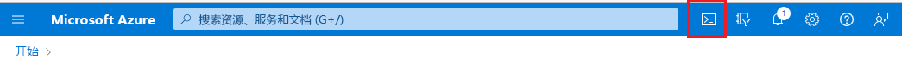
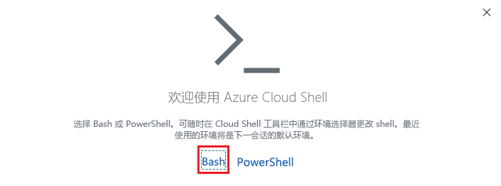
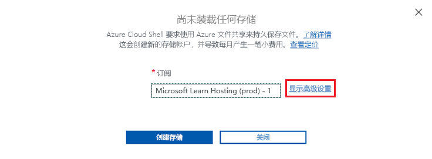
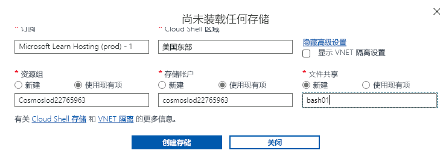

---
lab:
  title: 衡量单独和嵌入容器中实体的性能
  module: Module 8 - Implement a data modeling and partitioning strategy for Azure Cosmos DB SQL API
ms.openlocfilehash: cbbb77c27e8ac3503046211fe047e8bd6a9756b3
ms.sourcegitcommit: e2c44650d91ce5b92b82d1357b43c254c0691471
ms.translationtype: HT
ms.contentlocale: zh-CN
ms.lasthandoff: 04/13/2022
ms.locfileid: "141674619"
---
# <a name="measure-performance-of-entities-in-separate-and-embedded-containers"></a>衡量单独和嵌入容器中实体的性能

在本练习中，你将衡量将实体建模为单独的容器时与为将实体嵌入单个文档的 NoSQL 数据库建模时的客户实体的差异。

## <a name="prepare-your-development-environment"></a>准备开发环境

如果尚未准备好用于此实验室的 Azure Cosmos DB 数据库，请按照以下步骤进行操作。 否则，请转到“衡量单独容器中实体的性能”部分。

1. 在新的 Web 浏览器窗口或选项卡中，导航到 Azure 门户 (``portal.azure.com``)。

1. 使用提供的 Azure 凭据登录。

1. 在此实验室中，我们将使用 Azure Cloud Shell 终端加载示例数据，但在此之前，Azure Cloud Shell 将需要添加一个 Azure 存储帐户才能工作。 如果还没有可用的存储帐户，则需要创建一个。  如果已有权访问 Azure Cloud Shell，则可以跳过此步骤。

    1. 选择“创建资源”  选项。

    1. 搜索“存储帐户”。

    1. 在列表中选择“存储帐户”，并选择“创建” 。

    1. 如果尚未选择，请选择正确的“订阅”和“资源组” 。

    1. 使用小写字母和数字，为“存储帐户名称”选择一个唯一名称。  如果资源组名称足够唯一，也可以将其用作“存储帐户名称”。  将所有其他选项保留为默认值。

        > &#128221; 注意创建此存储帐户的“区域”，在下面首次设置 Azure Cloud Shell 时，需要选择同一区域。

    1. 选择“查看 + 创建”，通过验证后，选择“创建” 。

1. 如果已设置 Azure Cloud Shell，请在“Bash”模式下将其打开，否则请按照以下说明进行首次设置。

    

    1. 选择“Azure Cloud Shell”按钮将其打开。

    1. 选择“Bash”模式。

        
 
    1. 假设这是首次在此 Azure 帐户下运行 Azure Cloud Shell，需要将 Azure 存储帐户连接到此 Cloud Shell。  选择“显示高级设置”链接存储帐户。 

        
 
    1. 选择正确的“订阅”和“区域” 。 在“资源组”和“存储帐户”下，选择“使用现有”并且选择正确的资源组和存储帐户  。  在“文件共享”下，为共享提供该存储帐户下的唯一名称。 选择“创建存储”来完成 Cloud Shell 的设置。

        
 
1. 在“Azure Cloud Shell Bash 终端”中运行以下命令。 这些命令运行创建新 Azure Cosmos DB 帐户的脚本，然后构建并启动用于填充数据库的应用，完成练习。 可能需要 15-20 分钟才能完成生成，不妨在此时喝杯咖啡或茶。

    ```
    git clone https://github.com/microsoftlearning/dp-420-cosmos-db-dev
    cd dp-420-cosmos-db-dev/16-measure-performance
    bash init.sh
    dotnet add package Microsoft.Azure.Cosmos --version 3.22.1
    dotnet build
    dotnet run --load-data

    ```

1. 关闭 Cloud Shell 终端。

## <a name="measure-performance-of-entities-in-separate-containers"></a>衡量不同容器中的实体的性能

在 Database-v1 中，数据存储在单个容器中。 在该数据库中，运行查询来获取客户、客户地址和客户密码。 查看每个查询的请求费用。

### <a name="query-for-customer-entity"></a>查询客户实体

在 Database-v1 中，运行查询以获取客户实体并查看请求费用。

1. 如果尚未打开，请在新的 Web 浏览器窗口或选项卡中，导航到 Azure 门户 (``portal.azure.com``)。

1. 使用与你的订阅关联的 Microsoft 凭据登录到门户。

1. 在 Azure 门户菜单上或在主页中，选择“Azure Cosmos DB”。

1. 选择名称以 cosmicworks 开头的 Azure Cosmos DB 帐户。

1. 在左侧选择“数据资源管理器”。

1. 展开“Database-v1”。

1. 选择 Customer 容器。

1. 在屏幕顶部，选择“新建 SQL 查询”。

1. 复制粘贴以下 SQL 文本，然后选择“执行查询”。

    ```
    SELECT * FROM c WHERE c.id = "FFD0DD37-1F0E-4E2E-8FAC-EAF45B0E9447"
   ```

1. 选择“查询统计信息”选项卡，并记下请求费用为 2.83。

    

### <a name="query-for-customer-address"></a>查询客户地址

运行查询获取客户地址实体并查看请求费用。

1. 选择 CustomerAddress 容器。

1. 在屏幕顶部，选择“新建 SQL 查询”。

1. 复制粘贴以下 SQL 文本，然后选择“执行查询”。

    ```
    SELECT * FROM c WHERE c.customerId = "FFD0DD37-1F0E-4E2E-8FAC-EAF45B0E9447"
   ```

1. 选择“查询统计信息”选项卡，并记下请求费用为 2.83。

    

### <a name="query-for-customer-password"></a>查询客户密码

运行查询以获取客户密码实体并查看请求费用。

1. 选择 CustomerPassword 容器。

1. 在屏幕顶部，选择“新建 SQL 查询”。

1. 复制粘贴以下 SQL 文本，然后选择“执行查询”。

    ```
    SELECT * FROM c WHERE c.id = "FFD0DD37-1F0E-4E2E-8FAC-EAF45B0E9447"
   ```

1. 选择“查询统计信息”选项卡，并记下请求费用为 2.83。

    

### <a name="add-up-the-request-charges"></a>合计请求费用

现在我们已运行所有查询，接下来合计其所有请求单位成本。

|**查询**|**RU/秒 成本**|
|---------|---------|
|客户|2.83|
|客户地址|2.83|
|客户密码|2.83|
|**总 RU/秒**|**8.49**|

## <a name="measure-performance-of-embedded-entities"></a>衡量嵌入实体的性能

现在我们将查询相同的信息，但这次将实体嵌入到单个文档中。

1. 选择 Database-v2 数据库。

1. 选择 Customer 容器。

1. 运行以下查询。

    ```
    SELECT * FROM c WHERE c.id = "FFD0DD37-1F0E-4E2E-8FAC-EAF45B0E9447"
   ```

1. 请注意，返回的数据目前包括客户、地址和密码数据。

    

1. 选择“查询统计信息”。记下请求费用为 2.83，而之前运行的三个查询的费用为 8.49 RU/秒。

## <a name="compare-the-performance-of-the-two-models"></a>比较两个模型的性能

比较运行的每个查询的 RU/秒时，你会发现其客户实体嵌入单个文档的最后一个查询的成本远低于单独运行三个查询的总成本。 返回这些数据的延迟较低，因为数据是通过单个操作返回的。

搜索单个项目且了解数据的分区键和 ID 后，可通过调用 `ReadItemAsync()` 在 Azure Cosmos DB SDK 中使用 point-read 检索此数据。 点读速度比我们的查询还要快。 对于同一客户数据，成本仅为 1 RU/秒，几乎是原来的 1/3。
