---
lab:
  title: 反规范化数据和聚合以及使用更改源实现引用完整性的成本
  module: Module 8 - Implement a data modeling and partitioning strategy for Azure Cosmos DB SQL API
ms.openlocfilehash: 15cd43fa0d9b901c235384a3f2e89f36216f812a
ms.sourcegitcommit: afe4494c941a80ce5f692349bb002c9e984a6b24
ms.translationtype: HT
ms.contentlocale: zh-CN
ms.lasthandoff: 06/02/2022
ms.locfileid: "146018302"
---
# <a name="cost-of-denormalizing-data-and-aggregates-and-using-the-change-feed-for-referential-integrity"></a>反规范化数据和聚合以及使用更改源实现引用完整性的成本

使用关系模型可以让我们将不同的实体放置在它们自己的容器中。  但是，在 NoSQL 数据库中，容器之间没有联接，因此我们需要开始反规范化数据，以便消除联接的使用 。 此外，NoSQL 通过为数据建模来减少请求数，以便应用程序可以在尽可能少的请求中提取数据。 反规范化数据时出现的一个问题可能是实体之间的引用完整性，为此，可以使用更改源使数据保持同步。反规范化聚合（如按计数分组）还可以帮助我们减少请求。  

在此实验室中，你将了解反规范化数据和聚合如何帮助我们降低成本的好处，以及如何使用更改源来维护反规范化数据的引用完整性。

## <a name="prepare-your-development-environment"></a>准备开发环境

如果你还没有将 DP-420 的实验室代码存储库克隆到使用此实验室的环境，请按照以下步骤操作。 否则，请在 Visual Studio Code 中打开以前克隆的文件夹。

1. 启动 Visual Studio Code。

    > &#128221; 如果你还不熟悉 Visual Studio Code 界面，请参阅 [Visual Studio Code 入门指南][code.visualstudio.com/docs/getstarted]

1. 打开命令面板并运行 Git: Clone，将 ``https://github.com/microsoftlearning/dp-420-cosmos-db-dev`` GitHub 存储库克隆到你选择的本地文件夹中。

    > &#128161; 可以使用 CTRL+SHIFT+P 键盘快捷方式打开命令面板。

1. 克隆存储库后，打开在 Visual Studio Code 中选择的本地文件夹。

1. 在 Visual Studio Code 的“资源管理器”窗格中，浏览到 17-denormalize 文件夹  。

1. 打开 17-denormalize 文件夹的上下文菜单，然后选择“在集成终端中打开”以打开一个新的终端实例 。

1. 如果终端作为 Windows Powershell 终端打开，请打开一个新的 Git Bash 终端 。

    > &#128161; 要打开 Git Bash 终端，请在终端菜单的右侧，单击 + 符号旁边的下拉菜单，然后选择 Git Bash 。

1. 在 Git Bash 终端中，运行以下命令。 这些命令会打开浏览器窗口以连接到 Azure 门户，你将在其中使用提供的实验室凭据，运行创建新 Azure Cosmos DB 帐户的脚本，然后生成并启动用于填充数据库并完成练习的应用。 脚本要求提供 Azure 帐户的凭据后，可能需要 15-20 分钟才能完成生成，不妨在此时喝杯咖啡或茶。

    ```
    az login
    cd 17-denormalize
    bash init.sh
    dotnet add package Microsoft.Azure.Cosmos --version 3.22.1
    dotnet build
    dotnet run --load-data

    ```

1. 关闭集成终端。

## <a name="exercise-1-measure-performance-cost-when-denormalizing-data"></a>练习 1：在反规范化数据时衡量性能成本

### <a name="query-for-the-product-category-name"></a>查询产品类别名称

在 database-v2 容器（其中数据存储在各个容器中）中，运行查询以获取产品类别名称，然后查看该查询的请求费用。

1. 在新的 Web 浏览器窗口或选项卡中，导航到 Azure 门户 (``portal.azure.com``)。

1. 使用与你的订阅关联的 Microsoft 凭证登录到门户。

1. 在左窗格上，选择“Azure Cosmos DB”。
1. 选择名称以 cosmicworks 开头的 Azure Cosmos DB 帐户。
1. 在左窗格上，选择“数据资源管理器”。
1. 展开“database-v2”。
1. 选择 productCategory 容器。
1. 在页面顶部，选择“新建 SQL 查询”。
1. 在“查询 1”窗格上，粘贴以下 SQL 代码，然后选择“执行查询”。

    ```
    SELECT * FROM c where c.type = 'category' and c.id = "AB952F9F-5ABA-4251-BC2D-AFF8DF412A4A"
    ```

1. 选择“结果”选项卡，查看结果。 你会看到，此查询将返回产品类别的名称“Components, Headsets”。

    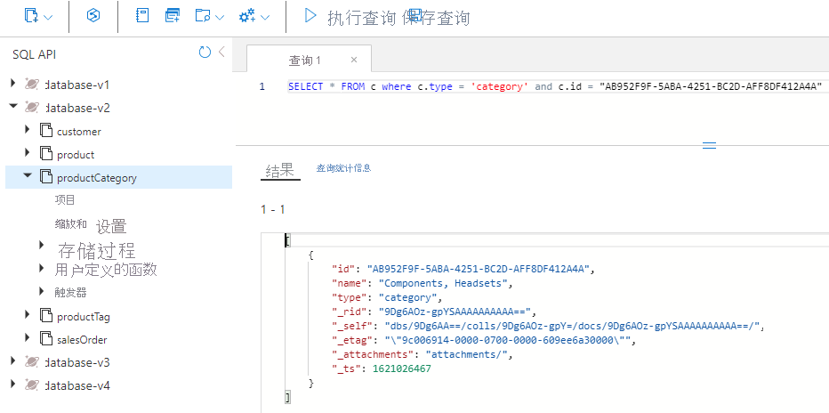

1. 选择“查询统计信息”选项卡，并记下请求费用为 2.93 RU（请求单位）。

    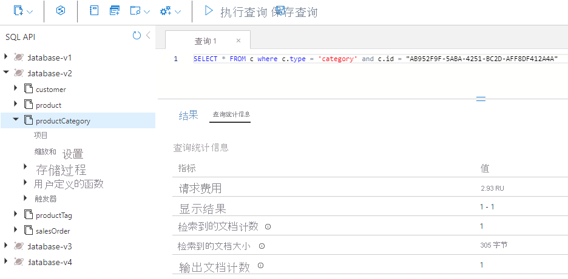

### <a name="query-for-the-products-in-the-category"></a>查询某一类别的产品

接下来，查询 product 容器以获取“Components, Headsets”类别的所有产品。

1. 选择 product 容器。
1. 在页面顶部，选择“新建 SQL 查询”。
1. 在“查询 2”窗格上，粘贴以下 SQL 代码，然后选择“执行查询”。

    ```
    SELECT * FROM c where c.categoryId = "AB952F9F-5ABA-4251-BC2D-AFF8DF412A4A"
    ```

1. 选择“结果”选项卡，查看结果。 你会看到返回了三个产品：HL Headset、LL Headset 和 ML Headset。 每个产品都有 SKU、名称、价格和一组产品标记。

1. 选择“查询统计信息”选项卡，并记下请求费用为 2.9 RU。

    

### <a name="query-for-each-products-tags"></a>查询每个产品的标记

接下来，针对以下三种产品查询 productTag 容器三次（每种产品一次）：HL Headset、LL Headset 和 ML Headset。

#### <a name="hl-headset-tags"></a>HL Headset 标记

首先，运行查询以返回 HL Headset 的标记。

1. 选择 productTag 容器。
1. 在页面顶部，选择“新建 SQL 查询”。
1. 在“查询 3”窗格上，粘贴以下 SQL 代码，然后选择“执行查询”。

    ```
    SELECT * FROM c where c.type = 'tag' and c.id IN ('87BC6842-2CCA-4CD3-994C-33AB101455F4', 'F07885AF-BD6C-4B71-88B1-F04295992176')
    ```

    此查询返回 HL Headset 产品的两个标记。

1. 选择“查询统计信息”选项卡，并记下请求费用为 3.06 RU。

    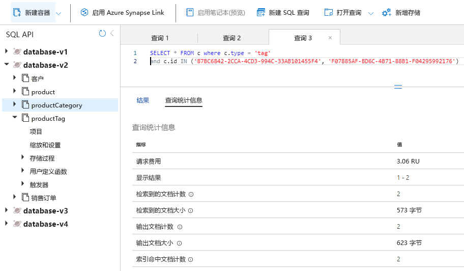

#### <a name="ll-headset-tags"></a>LL Headset 标记

接下来，运行查询以返回 LL Headset 的标记。

1. 选择 productTag 容器。
1. 在页面顶部，选择“新建 SQL 查询”。
1. 在“查询 4”窗格上，粘贴以下 SQL 代码，然后选择“执行查询”。

    ```
    SELECT * FROM c where c.type = 'tag' and c.id IN ('18AC309F-F81C-4234-A752-5DDD2BEAEE83', '1B387A00-57D3-4444-8331-18A90725E98B', 'C6AB3E24-BA48-40F0-A260-CB04EB03D5B0', 'DAC25651-3DD3-4483-8FD1-581DC41EF34B', 'E6D5275B-8C42-47AE-BDEC-FC708DB3E0AC')
    ```

    此查询返回 LL Headset 产品的五个标记。

1. 选择“查询统计信息”选项卡，并记下请求费用为 3.47 RU。

    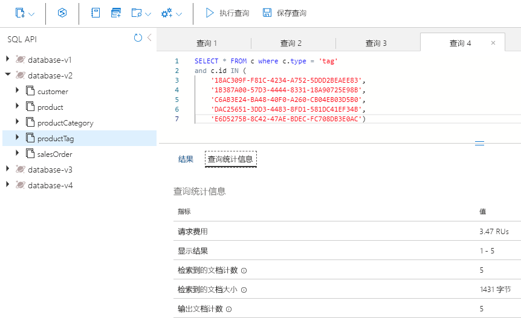

#### <a name="ml-headset-tags"></a>ML Headset 标记

最后，运行查询以返回 ML Headset 的标记。

1. 选择 productTag 容器。
1. 在页面顶部，选择“新建 SQL 查询”。
1. 在“查询 5”窗格上，粘贴以下 SQL 代码，然后选择“执行查询”。

    ```
    SELECT * FROM c where c.type = 'tag' and c.id IN ('A34D34F7-3286-4FA4-B4B0-5E61CCEEE197', 'BA4D7ABD-2E82-4DC2-ACF2-5D3B0DEAE1C1', 'D69B1B6C-4963-4E85-8FA5-6A3E1CD1C83B')
    ```

    此查询返回 ML Headset 产品的三个标记。

1. 选择“查询统计信息”选项卡，并记下请求费用为 3.2 RU。

    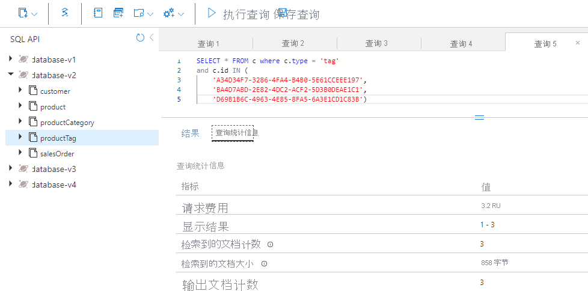

### <a name="add-up-the-ru-charges"></a>合计 RU 费用

现在，合计你运行的每个查询中的所有的 RU 成本。

|**查询**|**RU/秒 成本**|
|---------|---------|
|类别名称|2.93|
|产品|2.9|
|HL 产品标记|3.06|
|LL 产品标记|3.47|
|ML 产品标记|3.2|
|总 RU 成本|**15.56**|

### <a name="run-the-same-queries-for-your-nosql-design"></a>对 NoSQL 设计运行相同的查询

查询相同的信息，但这次是在非规范化数据库中。

1. 在数据资源管理器中，选择“database-v3”。
1. 选择 product 容器。
1. 在页面顶部，选择“新建 SQL 查询”。
1. 在“查询 6”窗格上，粘贴以下 SQL 代码，然后选择“执行查询”。

    ```
   SELECT * FROM c where c.categoryId = "AB952F9F-5ABA-4251-BC2D-AFF8DF412A4A"
   ```

    结果将如下所示：

    

1. 查看在此查询中返回的数据。 它包含呈现此类别产品所需的全部信息，包括这三种产品中每种产品的类别名称和标记名称。

1. 选择“查询统计信息”选项卡，并记下请求费用为 2.9 RU。

### <a name="compare-the-performance-of-the-two-models"></a>比较两个模型的性能

在关系模型中，数据存储在各个容器中，你运行了五个查询来获取类别的名称、该类别的所有产品以及每个产品的所有产品标记。 五个查询的请求费用合计为 15.56 RU/秒。

为了在 NoSQL 模型中获得相同的信息，你运行了一个查询，其请求费用为 2.9 RU。

这样做的好处不仅仅是降低了像这种模型一样的 NoSQL 设计的成本。 这种类型的设计速度也更快，因为它只需要一个请求。 此外，数据本身是以可能在网页上呈现的方式提供的。 这意味着在电子商务应用程序中需要编写和维护的下游代码更少。

使数据非规范化时，可以为电子商务应用程序生成更简单、更高效的查询。 你可以将应用程序所需的所有数据存储在单个容器中，并且可以使用单个查询提取这些数据。 在处理高并发性查询时，这种类型的数据建模可在简易性、速度和成本方面提供巨大优势。

---

## <a name="exercise-2-use-the-change-feed-to-manage-referential-integrity"></a>练习 2：使用更改源管理引用完整性

在本单元中，你将了解更改源如何帮助维护 Azure Cosmos DB 中两个容器之间的引用完整性。 在此方案中，使用更改源来侦听 productCategory 容器。 更新产品类别的名称时，更改源会捕获更新后的名称，并使用新名称更新该类别中的所有产品。

对于本练习，你将完成以下步骤：

- 完成一些 C# 代码，以突出显示要理解的关键概念。
- 启动更改源处理器，使其开始侦听 productCategory 容器。
- 查询 product 容器，查找要更改其名称的类别以及该类别中的产品数目。
- 更新类别名称并监视更改源是否已将更改传播到 product 容器中。
- 使用新的类别名称查询新的 product 容器，并计算产品数量以确保所有产品都已更新。
- 改回原来的名称并监视更改源是否已将更改传播回来。

### <a name="start-azure-cloud-shell-and-open-visual-studio-code"></a>启动 Azure Cloud Shell 并打开 Visual Studio Code

若要转到要针对更改源更新的代码，请执行以下操作：

1. 如果尚未打开，请打开 Visual Studio Code，然后打开 17-denormalize 文件夹中的 Program.cs 文件 。

### <a name="complete-the-code-for-change-feed"></a>完成更改源的代码

添加代码以处理传入委托中的更改，循环访问该类别的每个产品并对它们进行更新。

1. 转到启动更改源处理器的函数。

1. 选择 Ctrl+G，然后键入 603，在文件中跳到该行。

1. 现在应能看到以下代码：

    

   第 588 行和第 589 行是两个容器引用。 你需要使用正确的容器名称更新它们。 更改源的工作原理是对容器引用创建更改源处理器的实例。 在这种情况下，你将监视对 productCategory 容器的更改。

1. 在第 588 行，将 {container to watch} 替换为 `productCategory`。

1. 在第 589 行，将 {container to update} 替换为 `product`。 更新产品类别名称时，需要使用新的产品类别名称更新该类别的每个产品。

1. 在“要监视的容器”和“要更新的容器”行下方，查看 leaseContainer 行。 leaseContainer 的工作原理类似于容器上的检查点。 它知道自从更改源处理器最后一次检查后已更新哪些内容。
  
   当更改源发现新的更改时，它会调用委托并将更改传入只读集合中。

1. 在第 603 行，需要添加一些代码，当更改源具有需要处理的新更改时将调用这些代码。 为此，请复制以下代码片段，并将其粘贴到以 //To-Do: 开头的行下面

    ```
    //Fetch each change to productCategory container
    foreach (ProductCategory item in input)
    {
        string categoryId = item.id;
        string categoryName = item.name;
    
        tasks.Add(UpdateProductCategoryName(productContainer, categoryId, categoryName));
    }
    ```

1. 你的代码现在应如下图中的代码所示：

    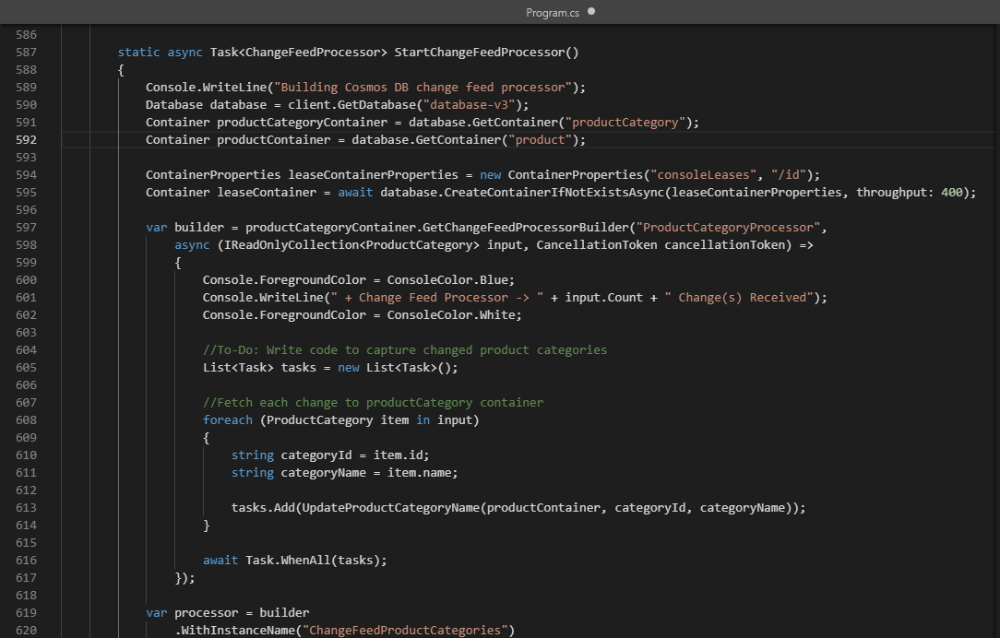

    默认情况下，更改源每秒运行一次。 如果在受监视的容器中进行大量插入或更新，委托可能会有多个更改。 因此，将委托 input 类型化为 IReadOnlyCollection 。

    此代码片段循环访问委托 input 中的所有更改，并将它们另存为 categoryId 和 categoryName 的字符串  。 然后，它将一个任务添加到任务列表中，并调用另一个函数来使用新的类别名称更新 product 容器。

1. 选择 Ctrl+G，然后输入 647 以查找 UpdateProductCategoryName() 函数 。 在这里，你需要编写一些代码，以使用更改源捕获的新的类别名称更新 product 容器中的每个产品。

1. 复制以下代码片段，并将其粘贴到以“//To-Do:”开头的行下面。 函数执行两项任务。 它首先查询 product 容器以查找传入的 categoryId 的所有产品。 然后使用新的产品类别名称更新每个产品。

    ```
    //Loop through all products
    foreach (Product product in response)
    {
        productCount++;
        //update category name for product
        product.categoryName = categoryName;
    
        //write the update back to product container
        await productContainer.ReplaceItemAsync(
            partitionKey: new PartitionKey(categoryId),
            id: product.id,
            item: product);
    }
    ```

    代码现应如下所示。

    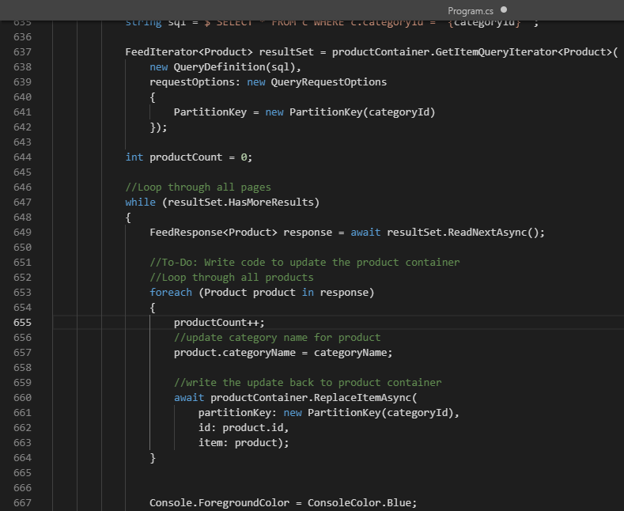

    此代码读取查询的响应对象中的行，然后针对查询返回的所有产品更新 product 容器。

    你将使用 foreach() 循环来遍历查询返回的每个产品。 对于每一行，你会更新计数器，这样就能知道有多少产品已更新。 接下来，你将该产品的类别名称更新为新的 categoryName。 最后调用 ReplaceItemAsync()，将 product 容器中的产品更新回来。

1. 选择 Ctrl+S 保存所做更改。

1. 如果尚未打开，请打开 Git Bash 集成终端，并确保位于 17-denormalize 文件夹下。

1. 若要编译和执行项目，请运行以下命令：

    ```
    dotnet build
    dotnet run
    ```

1. 你的屏幕现在应显示应用程序的主菜单。

    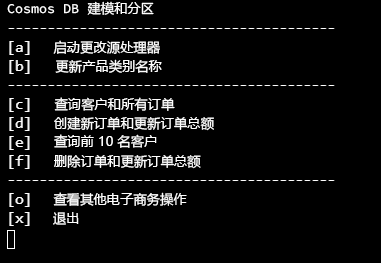

### <a name="run-the-change-feed-sample"></a>运行更改源示例

现在你已完成更改源的代码，接下来看看它的运行情况。

1. 在主菜单上，选择“a”以启动更改源处理器。 屏幕会显示进度。

    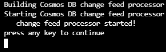

1. 按任意键返回到主菜单。

1. 在主菜单上选择“b”来更新产品类别名称。 随即会发生一系列顺序如下的操作：

    a. 在 product 容器中查询“Accessories, Tires, and Tubes”类别，并计算该类别有多少产品。  
    b. 更新该类别名称并将单词“and”替换为与符号 (&)。  
    c. 更改源将选取该更改，并使用你编写的代码更新该类别的所有产品。  
    d. 更改源还原名称更改并将类别名称改回，将“&”替换为原始的“and”。  
    e. 更改源选取此更改，并将所有产品更新回原始产品类别名称。

1. 选择主菜单上的“b”并按照提示操作，直到再次运行更改源，然后暂停。 结果将显示如下：

    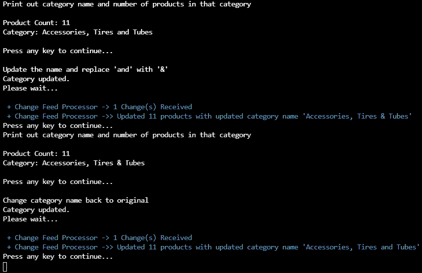

1. 如果离单击间隔过久并已返回到主菜单，请再次选择“b”来观察更改。

1. 完成后，键入 x 以退出并返回到 Cloud Shell。

---

## <a name="exercise-3-denormalizing-aggregates"></a>练习 3：反规范化聚合

在本单元中，你将了解如何使聚合非规范化，以便为电子商务站点编写针对排名前 10 的客户的查询。 你将使用 Azure Cosmos DB .NET SDK 中的事务性批处理功能，该功能同时插入新的销售订单并更新客户的 salesOrderCount 属性，这两者都在同一逻辑分区中。

对于本练习，你将完成以下步骤：

- 查看代码以创建新的销售订单。
- 完成 C# 代码以递增客户的 salesOrderCount。
- 完成 C# 代码以实现事务，从而使用事务性批处理插入新的销售订单并更新客户记录。
- 对特定客户运行查询，查看客户的记录及其所有的订单。
- 为该客户创建新的销售订单并更新其 salesOrderCount 属性。
- 运行针对排名前 10 的客户的查询，查看当前的结果如何。
- 演示在客户取消订单时如何使用事务性批处理。

## <a name="open-visual-studio-code"></a>打开“Visual Studio Code”

若要获取将在本单元中使用的代码，请执行以下操作：

1. 如果尚未打开，请打开 Visual Studio Code，然后打开 17-denormalize 文件夹中的 Program.cs 文件 。

## <a name="complete-the-code-to-update-total-sales-orders"></a>完成代码以更新总销售订单

1. 转到用于创建新销售订单的函数。

1. 选择 Ctrl+G，然后键入 483，在文件中跳到该行。

1. 现在应能看到以下代码：

    

    此函数使用事务性批处理创建新的销售订单并更新客户记录。

    首先，调用 ReadItemAsync() 并传入 customerId 作为分区键和 ID 来检索客户记录 。

1. 在 //To-Do: 注释下的第 483 行，通过粘贴以下代码片段来增加 salesOrderCount 的值 ：

    ```
    //Increment the salesOrderTotal property
    customer.salesOrderCount++;
    ```

    屏幕现在应该如下图所示：

    

## <a name="complete-the-code-to-implement-transactional-batch"></a>完成代码以实现事务性批处理

1. 向下滚动几行，查看你将为你的客户创建的新销售订单的数据。

    新的销售订单对象具有电子商务应用程序中销售订单的典型标头和详细信息结构。

    销售订单标头包含 orderId、customerId、orderDate 和 shipDate，你会将此项留空   。

    由于 customer 容器同时包含客户和销售订单实体，因此销售订单对象还包含值为 salesOrder 的鉴别器属性 type 。 这有助于区分销售订单与 customer 容器中的客户对象。

    再往下，你还可以看到订单的两个产品，它们构成了销售订单中的详细信息部分。

1. 再稍加滚动，滚动到另一个 //To-Do: 注释。 在这里，你需要添加使用事务性批处理插入新的销售订单并更新客户记录的代码。

1. 复制以下代码片段，然后将其粘贴到 //To-Do: 注释下的行上。

    ```
    TransactionalBatchResponse txBatchResponse = await container.CreateTransactionalBatch(
        new PartitionKey(salesOrder.customerId))
        .CreateItem<SalesOrder>(salesOrder)
        .ReplaceItem<CustomerV4>(customer.id, customer)
        .ExecuteAsync();
    
    if (txBatchResponse.IsSuccessStatusCode)
        Console.WriteLine("Order created successfully");
    ```

    此代码对容器对象调用 CreateTransactionalBatch()。 它采用分区键值作为必需参数，因为所有事务都限定在单个逻辑分区范围内。 你还将调用 CreateItem() 传入新的销售订单，调用 ReplaceItem() 传入更新后的客户对象 。 然后，调用 ExecuteAsync() 来执行事务。

    最后，通过查看响应对象来检查事务是否成功。

    你的屏幕现在应如下所示：

    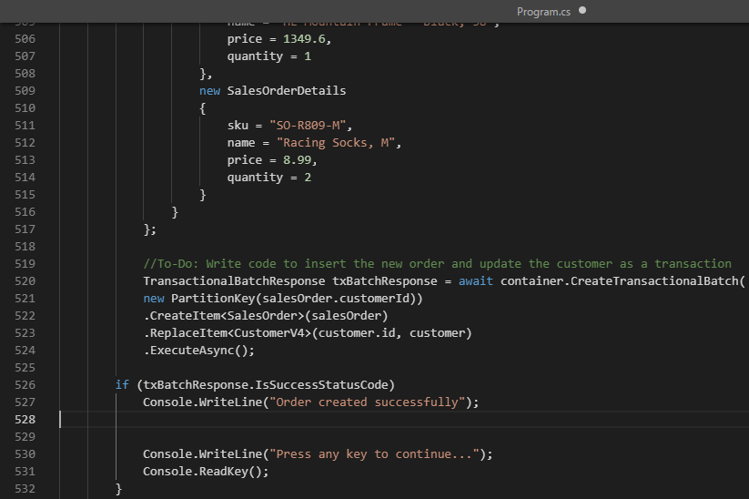

1. 选择 Ctrl+S 保存所做更改。

1. 如果尚未打开，请打开 Git Bash 集成终端，并确保位于 17-denormalize 文件夹下。

1. 若要编译和执行项目，请运行以下命令：

    ```
    dotnet build
    dotnet run
    ```

1. 你的屏幕现在应显示应用程序的主菜单，如下所示：

    

## <a name="query-for-the-customer-and-their-sales-orders"></a>查询客户及其销售订单

由于你已将数据库设计为使用 customerId 作为分区键来将客户及其所有销售订单存储在同一容器中，因此你可以在单个操作中查询客户容器，并返回客户的记录及其所有的销售订单。

1. 在主菜单上，选择“c”以运行“查询客户及其所有订单”的菜单项。 此查询会返回客户记录，后面跟该客户的所有销售订单。 屏幕上应会显示客户的所有销售订单输出。

   请注意，最后一个订单是“Road-650 Red, 58”，价格为 $782.99。

1. 向上滚动到“打印客户记录及其所有订单”。

   请注意，salesOrderCount 属性显示两个销售订单。

   屏幕应与下图中所示类似：

    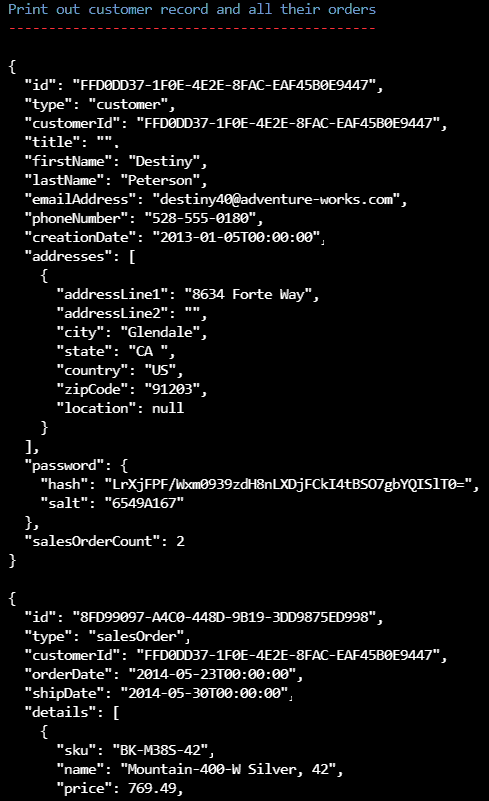

## <a name="create-a-new-sales-order-and-update-total-sales-orders-in-a-transaction"></a>在事务中创建新的销售订单并更新总销售订单

为同一客户创建新的销售订单，并更新其客户记录中保存的总销售订单。

1. 按窗口中的任何键返回到主菜单。
1. 选择“d”以运行“创建新订单并更新订单总数”的菜单项。
1. 按任意键返回到主菜单。
1. 选择“c”以再次运行同一查询。

   请注意，新的销售订单显示“HL Mountain Frame - Black, 38”和“Racing Socks, M”。

1. 滚动回“打印客户记录及其所有订单”。

   请注意，salesOrderCount 属性显示三个销售订单。

1. 屏幕应与下图中所示类似：

    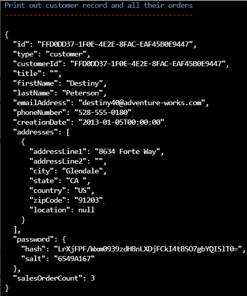

## <a name="delete-an-order-by-using-transactional-batch"></a>使用事务性批处理删除订单

与任何电子商务应用程序一样，客户也会取消订单。 你也可以在此处执行相同的操作。

1. 按任意键返回到主菜单。

1. 选择“f”以运行“删除订单并更新订单总计”的菜单项。

1. 按任意键返回到主菜单。
1. 选择“c”，再次运行同一查询以确认客户记录是否已更新。

   请注意，不再会返回新订单。 如果向上滚动，可以看到 salesOrderCount 值已返回到 2 。

1. 按任意键返回到主菜单。

## <a name="view-the-code-that-deletes-a-sales-order"></a>查看用于删除销售订单的代码

删除销售订单的方式与创建销售订单的方式完全相同。 这两个操作都包装在事务中，并在同一逻辑分区中执行。 接下来看一下执行该操作的代码。

1. 键入“x”退出应用程序。
1. 如果尚未打开，请打开 Visual Studio Code，然后打开 17-denormalize 文件夹中的 Program.cs 文件 。

1. 选择 Ctrl+G，然后输入 529。

    此函数会删除新的销售订单并更新客户记录。

    在这里，可以看到代码首先检索客户记录，然后将 salesOrderCount 递减 1。

    接下来是调用 CreateTransactionalBatch()。 再次传入逻辑分区键值，但这次使用订单 ID 调用 DeleteItem()，并使用更新后的客户记录调用 ReplaceItem() 。

## <a name="view-the-code-for-your-top-10-customers-query"></a>查看针对排名前 10 的客户的查询的代码

让我们看看针对排名前 10 的客户的查询。

1. 选择 Ctrl+G，然后输入 566。

    顶部附近是查询的定义。

    ```
    SELECT TOP 10 c.firstName, c.lastName, c.salesOrderCount
        FROM c WHERE c.type = 'customer'
        ORDER BY c.salesOrderCount DESC
    ```

    此查询非常简单，使用 TOP 语句来限制返回的记录数，并按降序对 salesOrderCount 属性使用 ORDER BY  。

    另请注意，鉴别器属性 type 的值为 customer，因此你只返回客户，原因是你的 customer 容器同时包含客户和销售订单 。

1. 若要在应用程序尚未运行时再次启动，请运行以下命令：

    ```
    dotnet run
    ```

1. 最后，键入“e”来运行查询。

    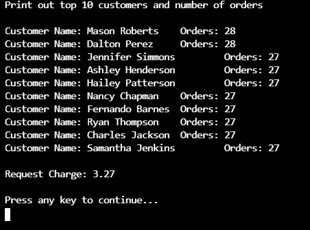

    你可能不知道，针对排名前 10 的客户的查询是跨分区查询，它跨容器的所有分区扇出。

    此实验室的配套实验室指出，应尽量避免跨分区查询。 但实际上，在容器仍然较小或查询不经常运行的情况下，此类查询是可行的。 如果此查询经常运行或容器特别大，则值得探究将此数据具体化到另一个容器并用它来为此查询提供服务的成本。

[code.visualstudio.com/docs/getstarted]: https://code.visualstudio.com/docs/getstarted/tips-and-tricks
